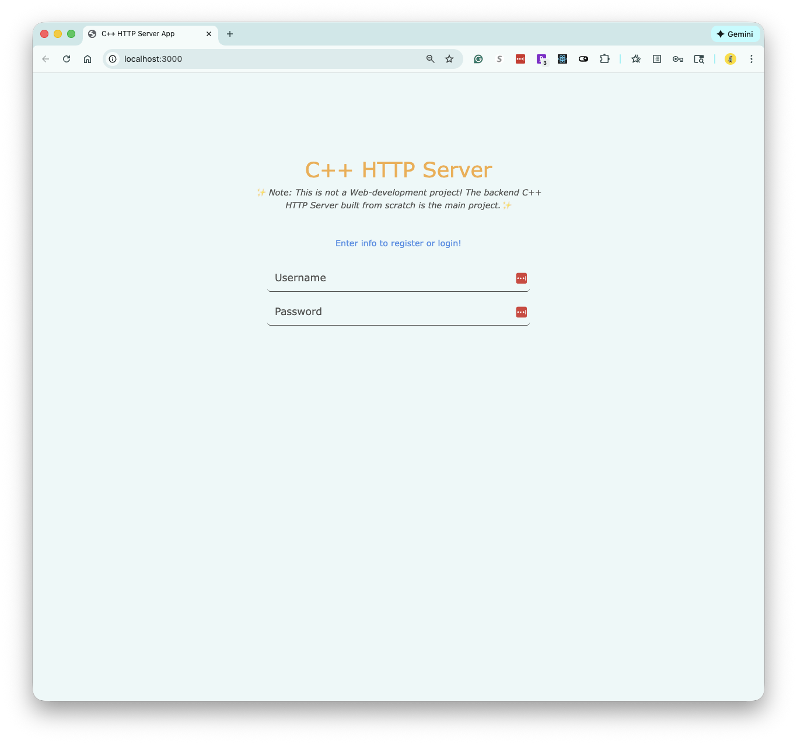
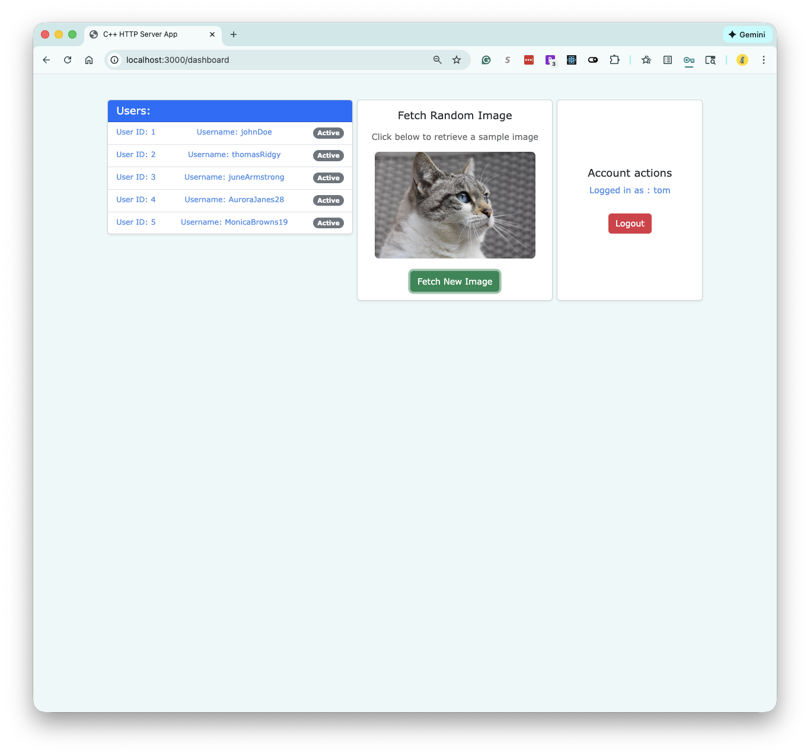

# Http Server Built On C++ From Scratch

**External software**:

1. Conan package manager
2. Google Test (GTest)
3. SQLite database.
4. [Bcrypt.cpp](https://github.com/hilch/Bcrypt.cpp) | Hashing passwords.
5. [jwt-cpp](https://github.com/Thalhammer/jwt-cpp/tree/master) | Handling User's session.
6. React: Frontend; solely for demonstration purposes.
7. Docker

**Objectives**:

- Client can:
    1. Register & login.
    2. Retrieve cat images.
    3. Use previous session (JWT token) to stay logged in.

- Server is Multi-Threaded.
- Implement a server logger.
- Implement testing with GTest.
- Implement `Docker`, `Conan`, and `CMake`.

<p align="center">
    
    
</p>

## How To Run Project

[Project configurations](.env)

### Run Using Docker (Runs On All Operating Systems)

- Prerequisites: You must have Docker installed!

    ```sh
    # Clone and `cd` into project's root.
    # Run the two containers using compose: First one for the backend; and second for the frontend.
    docker compose up --build --attach server; 
    # The --attach server is to only see the logs of the backend.
    ```

  - [Go to frontend](http://localhost:3000/)

### Or Run With Just Conan And Cmake (Mac Only)

- Prerequisites: You must have Conan (with pip) and Cmake (with homebrew) installed!

1. Start-up the backend server:

    ```sh
    # Install backend dependencies
    conan build .;
    # Start the backend
    ./build/Release/HttpServer;
    ```

    - If you are using the VSC [clangd](https://marketplace.visualstudio.com/items?itemName=llvm-vs-code-extensions.vscode-clangd) extension, then create a symlink from the './build/Release/compile_commands.json' to the project's root, so the extension can work properly.

        ```bash
        ln -s build/Release/compile_commands.json;
        #  Then restart clangD → VSC keyboard-shortcut: Cmd + Shift + P → clangd: Restart language server.
        ```

2. Serve React frontend:

    - Open a new tab in your CLI, and navigate into the project's root!

    ```sh
    # Make sure u are in project's root and you have NODE and NPM installed!
    cd frontend/client;
    npm install;

    # Build the React app for production
    npm run build;
        # For developer mode use: `npm start`

    # Install serve package to serve the build
    npm install -g serve;

    # Serve the build
    serve -s build;
    ```

   - [Go to frontend](http://localhost:3000/)


3. How To Run Unit Tests

    ```sh
    conan build .; # Build
    # Test
    ./build/Release/unit_tests; # Or: ctest --test-dir build/Release --output-on-failure
    ```
